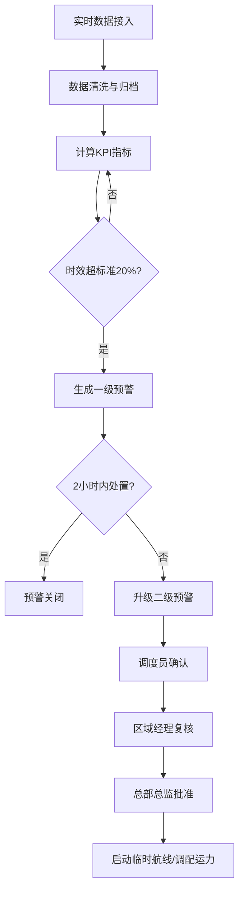
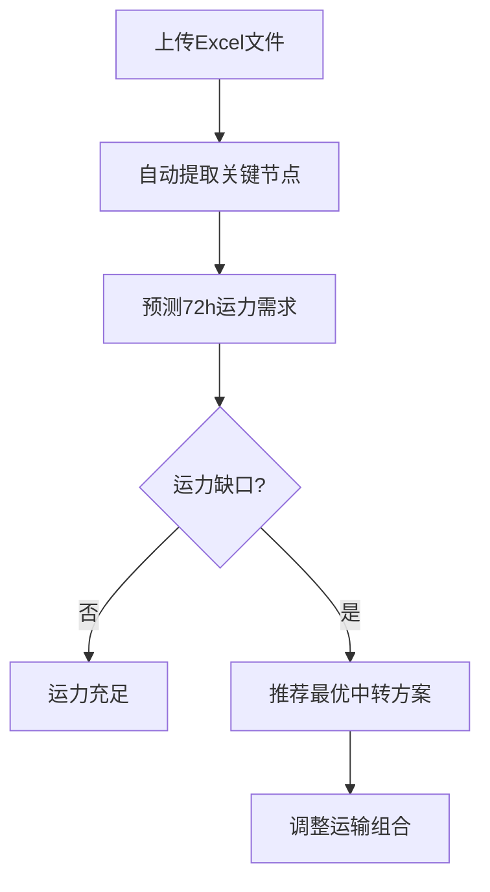

## 1. 产品概述

全国性集装箱多式联运协同调度与碳排放智能分析平台，面向联运调度员、区域联运经理、总部运营总监三级用户，实时汇聚港口、铁路场站、公路卡口、航运船舶的多源数据，自动计算全程时效、碳排放强度、运输成本与设备周转率，提供预警联动审批、运力预测推荐、运营健康诊断等智能化能力，助力全国多式联运降本增效与绿色减排。

- 解决多式联运数据孤岛、时效不可控、碳排放缺乏量化分析等核心痛点
- 目标用户：联运调度员、区域联运经理、总部运营总监

## 2. 核心功能

### 2.1 用户角色

| 角色 | 注册方式 | 核心权限 |
|------|----------|----------|
| 联运调度员 | 站点管理员分配 | 查看所辖站点联运明细、处理一级预警、确认三级审批第一步 |
| 区域联运经理 | 总部管理员分配 | 查看所辖区域联运明细与统计报表、复核三级审批第二步 |
| 总部运营总监 | 系统默认分配 | 查看全国联运明细与统计报表、批准三级审批第三步、查看运营诊断报告 |

### 2.2 功能模块

1. **核心看板页面**：全国多式联运时效热力图、碳排放排名、运输方式切换、省份筛选
2. **预警中心页面**：一级/二级预警列表、三级审批流程、预警详情与处置
3. **港口下钻详情页面**：各航线近7天集装箱吞吐量趋势曲线、运输方式占比分布
4. **运力预测页面**：上传船期表与报关单Excel、72小时运力缺口预测、最优中转方案推荐
5. **运营诊断报告页面**：全程时效同比环比、碳排放量分布、运输成本结构、优化路径与减排策略推荐

### 2.3 页面详情

| 页面名称 | 模块名称 | 功能描述 |
|----------|----------|----------|
| 核心看板 | 时效热力图 | 按省份着色展示全国多式联运平均时效，支持按运输方式（铁水联运、公铁联运、水水联运等）切换 |
| 核心看板 | 碳排放排名 | 按运输线路/港口排列碳排放强度TOP10，支持切换时间维度 |
| 核心看板 | 关键指标卡片 | 全程平均耗时、平均碳排放强度、平均运输成本、设备周转率四大KPI实时展示 |
| 核心看板 | 联运线路状态列表 | 展示各联运线路当前时效状态（正常/预警/超时），支持点击跳转预警中心 |
| 预警中心 | 预警列表 | 按等级筛选预警，展示预警线路、触发条件、持续时间、当前状态 |
| 预警中心 | 预警详情弹窗 | 展示预警线路完整运输档案、滞留节点定位、历史同线路时效对比 |
| 预警中心 | 三级审批流程 | 调度员确认→区域经理复核→总部总监批准，显示当前审批节点与审批历史 |
| 港口下钻详情 | 7天吞吐量趋势 | ECharts折线图展示近7天集装箱吞吐量变化趋势 |
| 港口下钻详情 | 运输方式占比 | 饼图展示该港口铁路/公路/水运集装箱占比分布 |
| 港口下钻详情 | 航线列表 | 展示该港口所有航线状态、在途箱量、平均时效 |
| 运力预测 | 文件上传区 | 支持拖拽上传船期表/报关单Excel，自动解析关键节点 |
| 运力预测 | 72小时运力缺口图 | 时间轴展示未来72小时各时段预测运力需求与可用运力对比 |
| 运力预测 | 中转方案推荐 | 当预测超出可用运力时，自动推荐最优中转方案或运输组合调整建议 |
| 运营诊断报告 | 时效分析 | 全程时效同比环比对比图表，异常时段高亮 |
| 运营诊断报告 | 碳排放分析 | 碳排放量分布图、各运输方式碳排放占比 |
| 运营诊断报告 | 成本结构分析 | 运输成本结构饼图、成本趋势折线图 |
| 运营诊断报告 | 优化建议 | 基于数据对比推荐优化路径和减排策略 |

## 3. 核心流程

### 3.1 预警触发与审批流程

1. 系统实时监测各联运线路时效数据
2. 当某条线路连续3天平均时效超过标准值20%，或某节点滞留超时 → 自动生成一级预警推送至调度员
3. 调度员2小时内未处置 → 升级为二级预警
4. 二级预警触发三级审批流程：调度员确认 → 区域联运经理复核 → 总部运营总监批准
5. 审批通过后启动临时航线或调配运力

### 3.2 运力预测与推荐流程

1. 用户上传船期表/报关单Excel
2. 系统自动提取关键节点（起运港、中转港、目的港、预计到港时间等）
3. 基于历史数据和上传数据预测未来72小时运力需求
4. 对比可用运力，计算运力缺口
5. 当缺口存在时，自动推荐最优中转方案或运输组合调整

## 4. 用户界面设计

### 4.1 设计风格

- 主色调：深海蓝 (#0B1D3A) + 碳绿 (#00C9A7)，传达专业物流+绿色低碳双重理念
- 辅助色：预警橙 (#FF8C42)、危险红 (#FF4757)、背景深灰 (#0F1923)
- 按钮风格：圆角8px，主按钮填充渐变色，次按钮描边
- 字体：标题使用 DIN Alternate（数字数据感强），正文使用 Noto Sans SC
- 布局：左侧导航栏 + 顶部工具栏 + 主内容区，卡片式模块布局
- 图标风格：线性图标（Lucide），与数据可视化配合
- 背景：深色主题，配合微妙的渐变网格纹理增加科技感

### 4.2 页面设计概览

| 页面名称 | 模块名称 | UI元素 |
|----------|----------|--------|
| 核心看板 | 时效热力图 | 深色背景中国地图SVG，省份按时效梯度着色（绿→黄→橙→红），hover显示详情浮层 |
| 核心看板 | 碳排放排名 | 横向柱状图，渐变色柱体，TOP10标号 |
| 核心看板 | 关键指标卡片 | 四宫格卡片，大号数字+趋势箭头+迷你趋势线 |
| 预警中心 | 预警列表 | 表格布局，一级橙色标签、二级红色标签，行点击展开详情 |
| 预警中心 | 三级审批流程 | 步骤条组件，已完成节点绿色勾选，当前节点脉冲动画 |
| 港口下钻详情 | 吞吐量趋势 | ECharts折线图，渐变填充区域，鼠标悬浮十字准线 |
| 港口下钻详情 | 运输方式占比 | 环形饼图，中心显示总量，扇区hover弹出详情 |
| 运力预测 | 文件上传区 | 虚线边框拖拽区域，上传成功后显示解析进度条 |
| 运力预测 | 运力缺口图 | ECharts面积图，需求线与可用线之间缺口区域红色填充 |
| 运营诊断报告 | 时效分析 | 双轴折线图（同比+环比），异常点标注 |
| 运营诊断报告 | 优化建议 | 卡片式推荐列表，每条含优先级标签和预期效果 |

### 4.3 响应式设计

- 桌面优先设计，主要面向1920×1080及以上分辨率的大屏监控场景
- 1440px宽度适配：缩小卡片间距，热力图自适应缩放
- 1280px宽度适配：隐藏侧边栏文字仅保留图标，关键指标卡片2×2布局

### 4.4 3D场景指引

- 不适用
