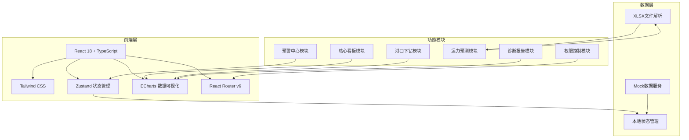
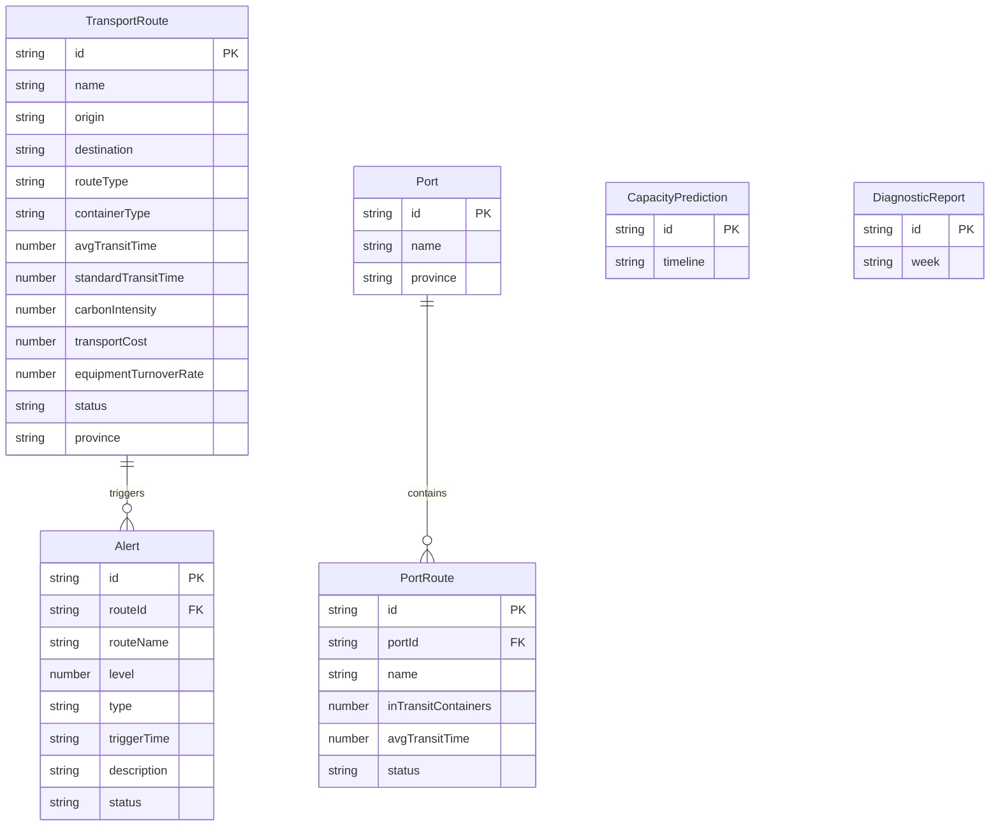

## 1. 架构设计



## 2. 技术说明

- 前端：React@18 + TypeScript + Tailwind CSS@3 + Vite
- 初始化工具：vite-init
- 后端：无（纯前端项目，使用Mock数据）
- 数据库：无（使用内存状态管理 + Mock数据模拟）
- 图表库：ECharts（通过echarts-for-react封装）
- 文件解析：xlsx（解析上传的Excel文件）
- 状态管理：Zustand

## 3. 路由定义

| 路由 | 用途 | 权限 |
|------|------|------|
| / | 核心看板页面，展示全国联运时效热力图与碳排放排名 | 全部角色 |
| /alert | 预警中心，展示预警列表与审批流程 | 全部角色（审批按角色区分） |
| /port/:portId | 港口下钻详情，展示吞吐量趋势与运输方式占比 | 全部角色 |
| /prediction | 运力预测，上传文件与运力缺口分析 | 全部角色 |
| /report | 运营诊断报告，时效/碳排放/成本分析 | 区域经理+总部总监 |

## 4. API定义

本项目为纯前端，使用Mock数据模拟API。核心数据结构定义如下：

### 4.1 联运线路数据

```typescript
interface TransportRoute {
  id: string
  name: string
  origin: string
  destination: string
  routeType: "铁水联运" | "公铁联运" | "水水联运" | "公水联运"
  containerType: "20GP" | "40GP" | "40HC" | "20RF"
  avgTransitTime: number
  standardTransitTime: number
  carbonIntensity: number
  transportCost: number
  equipmentTurnoverRate: number
  status: "正常" | "预警" | "超时"
  province: string
}
```

### 4.2 预警数据

```typescript
interface Alert {
  id: string
  routeId: string
  routeName: string
  level: 1 | 2
  type: "时效超标" | "节点滞留"
  triggerTime: string
  description: string
  status: "待处理" | "处理中" | "已升级" | "已关闭"
  approval?: {
    step: 0 | 1 | 2 | 3
    schedulerConfirmed: boolean
    regionalManagerApproved: boolean
    hqDirectorApproved: boolean
    history: ApprovalRecord[]
  }
}

interface ApprovalRecord {
  step: number
  role: string
  action: "确认" | "复核" | "批准" | "驳回"
  time: string
  comment: string
}
```

### 4.3 港口数据

```typescript
interface Port {
  id: string
  name: string
  province: string
  throughput7Days: { date: string; value: number }[]
  transportModeDistribution: { mode: string; ratio: number; count: number }[]
  routes: PortRoute[]
}

interface PortRoute {
  id: string
  name: string
  inTransitContainers: number
  avgTransitTime: number
  status: "正常" | "预警" | "超时"
}
```

### 4.4 运力预测数据

```typescript
interface CapacityPrediction {
  timeline: { hour: string; demand: number; available: number }[]
  gap: { startHour: string; endHour: string; gapAmount: number }[]
  recommendations: Recommendation[]
}

interface Recommendation {
  id: string
  type: "中转方案" | "运输组合调整"
  description: string
  expectedEffect: string
  priority: "高" | "中" | "低"
}
```

### 4.5 诊断报告数据

```typescript
interface DiagnosticReport {
  week: string
  transitTime: {
    current: number
    weekOnWeek: number
    yearOnYear: number
    dailyData: { date: string; value: number; wowChange: number }[]
  }
  carbonEmission: {
    total: number
    distribution: { mode: string; amount: number; ratio: number }[]
    trend: { week: string; value: number }[]
  }
  costStructure: {
    total: number
    breakdown: { category: string; amount: number; ratio: number }[]
    trend: { week: string; value: number }[]
  }
  recommendations: {
    type: "优化路径" | "减排策略"
    description: string
    expectedSaving: string
    priority: "高" | "中" | "低"
  }[]
}
```

## 5. 服务器架构图

不适用（纯前端项目）

## 6. 数据模型

### 6.1 数据模型定义



### 6.2 数据定义语言

本项目使用Mock数据，无需DDL语句。数据通过TypeScript模块直接定义在`src/mock/`目录下。
